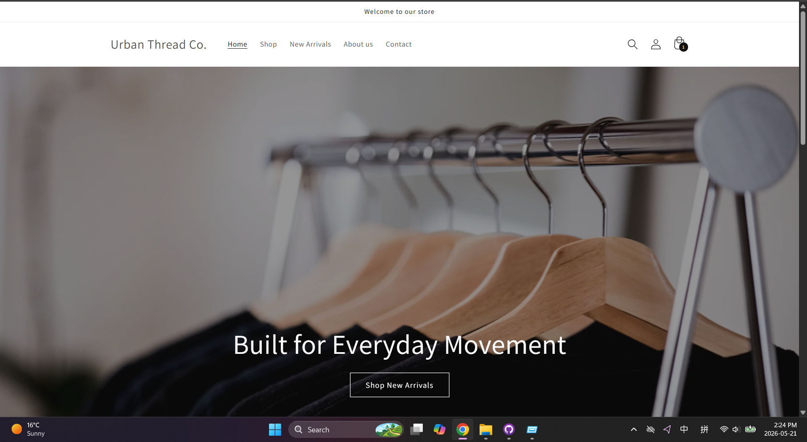
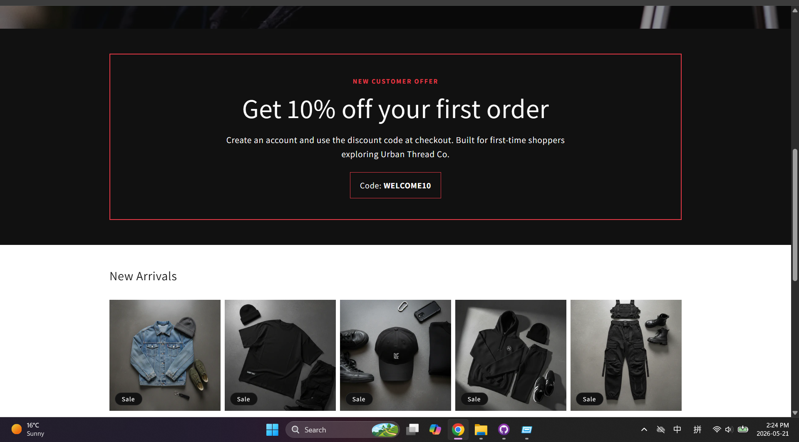
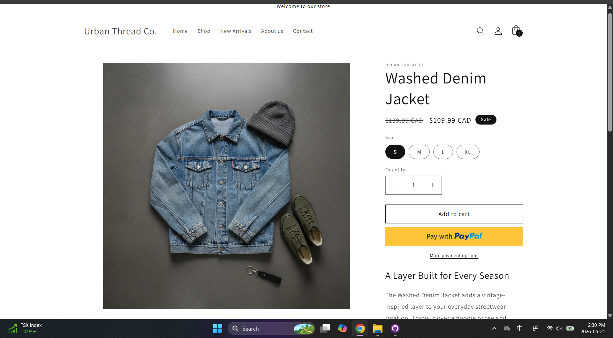
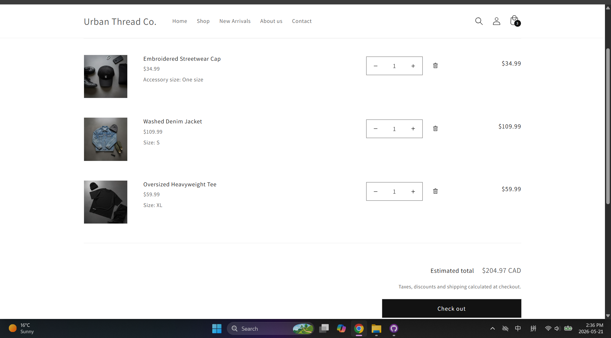
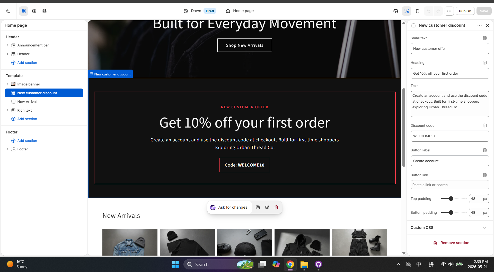
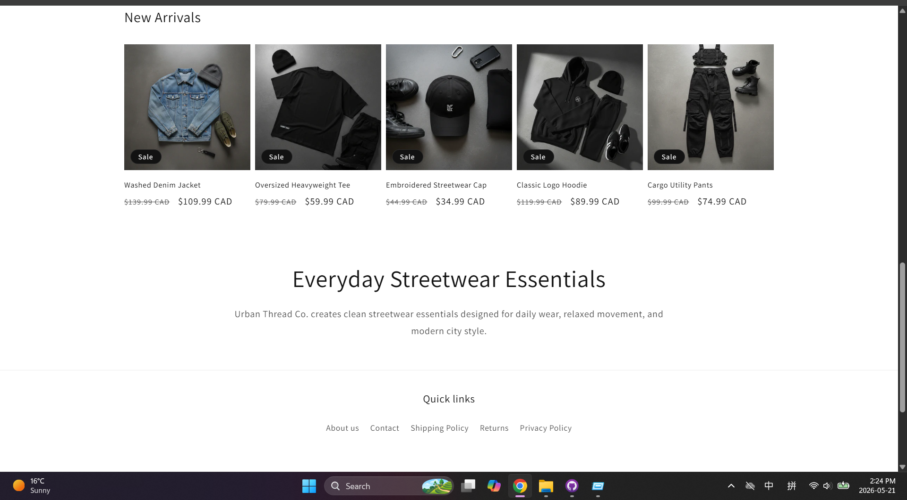

# Shopify Dawn Streetwear Demo

A Shopify Dawn theme customization demo for a fictional streetwear brand: **Urban Thread Co.**

This project shows how I customized a Shopify Dawn storefront for a clothing/e-commerce brand, including homepage layout, product collections, product pages, size options, cart flow, discount setup, and a custom Liquid discount banner.

## What This Demo Shows

This demo was built to practice the type of Shopify work often needed for a clothing brand or online store:

- Customizing a Dawn theme storefront
- Turning a basic theme into a branded shopping experience
- Setting up products, collections, prices, sale badges, and size variants
- Creating a homepage with hero banner, product section, brand story, newsletter, and footer
- Testing the customer flow from product page to cart
- Building a custom promotional banner with Liquid

## Storefront Features

- Fictional streetwear brand: **Urban Thread Co.**
- Homepage hero banner with call-to-action
- Navigation menu with Home, Shop, New Arrivals, About us, and Contact
- New Arrivals product collection
- Product cards with images, sale badges, compare-at prices, and sale prices
- Product detail pages with size variants
- Add to Cart and cart flow testing
- Footer links for About us, Contact, Shipping Policy, Returns, and Privacy Policy
- Newsletter signup section
- New customer discount banner for code **WELCOME10**

## Custom Liquid Work

I created a custom Liquid section for the new customer discount banner:

`sections/new-customer-discount-banner.liquid`

The banner is editable inside the Shopify Theme Editor. The store owner can update:

- Small text
- Heading
- Description
- Discount code
- Button label
- Button link
- Top and bottom spacing

This was added to show basic Shopify Liquid section development, not just visual theme editing.

## Shopify Skills Demonstrated

- Shopify Dawn theme customization
- Shopify Theme Editor setup
- Liquid section development
- Shopify schema settings
- Product collections
- Product variants
- Discount banner setup
- Navigation and footer setup
- Apparel storefront layout
- Basic cart flow testing
- Basic responsive storefront testing

## Screenshots

### Homepage Hero Section

### Homepage with Custom Discount Banner and Product Collection

### Product Page with Size Variants and Add to Cart

### Cart Flow

### Shopify Theme Editor Custom Section Settings

### Brand Story and Footer Area

## Notes

This is a portfolio demo built with a fictional brand. It does not use real customer data, real orders, or real client assets.

Checkout may be limited depending on Shopify trial and payment settings, but the storefront flow up to cart was tested.

## Status

Portfolio demo for Shopify Dawn theme customization practice.